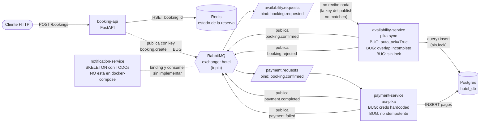

# Arquitectura actual (rota)

Este es el estado en el que reciben el proyecto. Hay 3 servicios desplegados y un cuarto que existe como código pero no está en `docker-compose`. La mensajería está mal configurada en varios puntos y el flujo nunca llega al final.

## Problemas conocidos en este estado

1. **booking-api publica al routing key equivocado** (`booking.create` en vez de `booking.requested`) → la queue `availability.requests` está bindeada al key correcto, así que el mensaje no llega a ningún consumer y se descarta.
2. **booking-api devuelve 200 aunque el publish falle** → el cliente recibe respuesta engañosa.
3. **availability-service usa `auto_ack=True`** → pierde mensajes si crashea a la mitad del procesamiento.
4. **availability-service tiene la lógica de overlap incompleta** → reservas con fechas solapadas pasan como disponibles.
5. **availability-service no usa `with_for_update()`** → race condition con reservas concurrentes sobre la misma habitación.
6. **payment-service tiene credenciales hardcodeadas** → mal de seguridad y de configuración (no se puede cambiar el host de Postgres sin reconstruir la imagen).
7. **payment-service no es idempotente** → si RabbitMQ reentrega el mismo evento, cobra dos veces.
8. **notification-service** existe como código pero (a) no está declarado en `docker-compose.yml`, (b) los TODOs del consumer no están resueltos.
